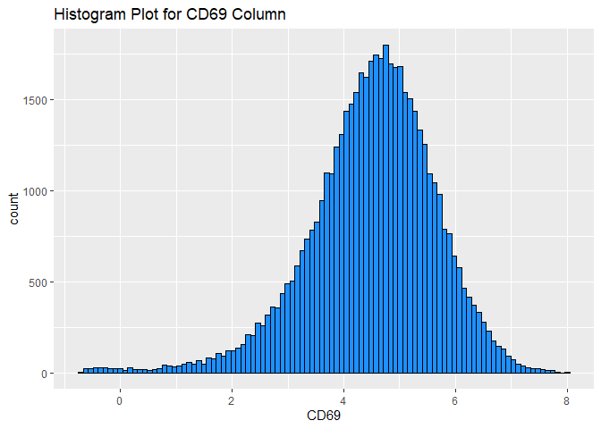
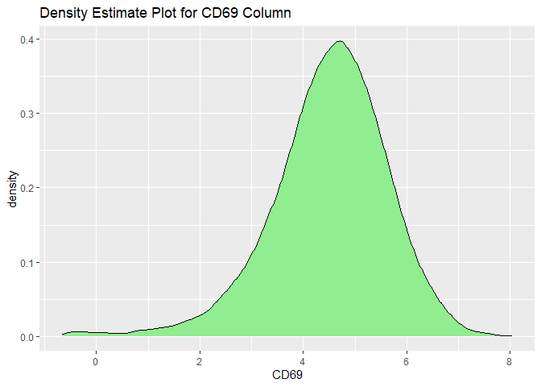
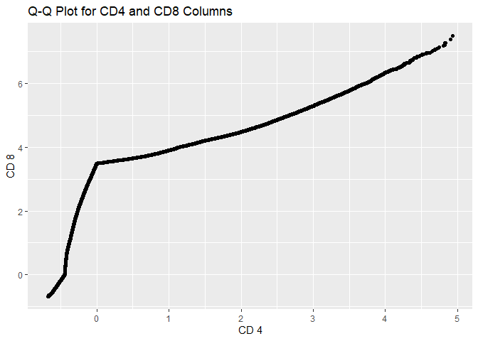

DSC1105_FA1_Rodillas
================
Rodillas
2025-02-02

``` r
library(ggplot2)
library(dplyr)
```

    ## 
    ## Attaching package: 'dplyr'

    ## The following objects are masked from 'package:stats':
    ## 
    ##     filter, lag

    ## The following objects are masked from 'package:base':
    ## 
    ##     intersect, setdiff, setequal, union

``` r
cytof_data <- read.csv("E:/Downloads/cytof_one_experiment.csv")
#1.Using the CD69 column
## for histogram (first example)
ggplot(cytof_data) + geom_histogram(aes(x = CD69), bins = 100, fill = 'dodgerblue', color ='black') + ggtitle("Histogram Plot for CD69 Column")
```

<!-- -->

``` r
## for density estimate (second example)

ggplot(cytof_data) + geom_density(aes(x = CD69), fill = 'lightgreen', color ='black') + ggtitle("Density Estimate Plot for CD69 Column")
```

<!-- -->

Observation: Both plots of the histogram and density estimate yielded
almost identical results. Upon inspection, the column CD69 was not
normally distributed. Although the plot shows symmetry around the mean,
this plot has a longer right tail, hence suggesting a right-skewed
shape. Upon extra testing, such as Shapiro-Wilk Normality Test could
conclude its normality. The extended right tail also suggests a a
presence of potential outliers or extreme values.

The distribution appears to be unimodal, where the peak is concentrated
at a singular point. Upon inspection at the midpoint, the mean can be
estimated at around 5. On the inspection of the plot, distribution
extends more towards the right (higher values), with a tail decreasing
towards larger values. Although most values are on the lower side, there
are some higher outliers.

``` r
CD4_data <- cytof_data$CD4
CD8_data <- cytof_data$CD8

qq.data <- as.data.frame(qqplot(CD4_data, CD8_data, plot.it = FALSE))
ggplot(qq.data, aes(x = x, y = y)) + geom_point() + xlab("CD 4") + ylab("CD 8") + ggtitle("Q-Q Plot for CD4 and CD8 Columns")
```

<!-- -->

Observation: Upon analyzing the q-q plot, it can be suggested that along
the central ranges, or their median, the two columns procures almost
similar in distribution. In addition, on both on their tails, there may
be slight deviations that may stem from factors such as the behavior
when comparing the extreme values. On the right tail, since it deviates
upward, it may suggest that CD 4, or the x-axis, has more extreme
values. On the other hand, the left tail has a similar upward trend,
suggesting that CD 8 has more extreme lower values than the CSD 4
column.
