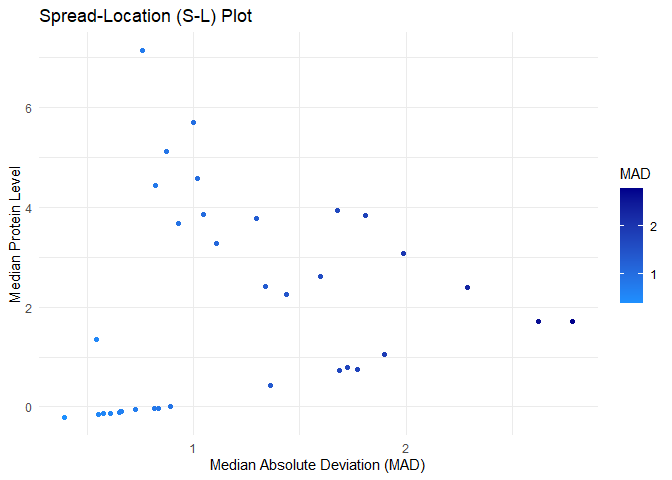

DSC1105_FA_2
================
Rodillas
2025-02-13

## Cytof Data

``` r
library(ggplot2)
library(dplyr)
library(tidyverse)
```

``` r
cytof_data <- read.csv("E:/Downloads/cytof_one_experiment.csv")


cytof_pl <- cytof_data %>% 
  pivot_longer(
    cols = everything(),
    names_to = "protein",
    values_to = "amount",
  )
cytof_pl
```

    ## # A tibble: 1,750,000 × 2
    ##    protein   amount
    ##    <chr>      <dbl>
    ##  1 NKp30      0.188
    ##  2 KIR3DL1    3.62 
    ##  3 NKp44     -0.561
    ##  4 KIR2DL1   -0.294
    ##  5 GranzymeB  2.48 
    ##  6 CXCR6     -0.145
    ##  7 CD161     -0.315
    ##  8 KIR2DS4    1.94 
    ##  9 NKp46      4.08 
    ## 10 NKG2D      2.62 
    ## # ℹ 1,749,990 more rows

``` r
protein_level <- cytof_pl %>%
  group_by(protein) %>%
  summarise(Median = median(amount, na.rm = TRUE),
            MAD = mad(amount, na.rm =  TRUE)) 

protein_level
```

    ## # A tibble: 35 × 3
    ##    protein  Median   MAD
    ##    <chr>     <dbl> <dbl>
    ##  1 CD107a  -0.122  0.609
    ##  2 CD16     5.12   0.874
    ##  3 CD161    0.726  1.69 
    ##  4 CD2      3.95   1.68 
    ##  5 CD4     -0.204  0.395
    ##  6 CD56     5.71   0.998
    ##  7 CD57     3.07   1.99 
    ##  8 CD69     4.59   1.02 
    ##  9 CD8      2.40   2.29 
    ## 10 CXCR6   -0.0581 0.727
    ## # ℹ 25 more rows

``` r
ggplot(protein_level, aes(x = `MAD`, y = Median, color = `MAD`)) +
  geom_point() + scale_color_gradient(low = "dodgerblue", high = "darkblue") +
  labs(title = "Spread-Location (S-L) Plot",
       x = "Median Absolute Deviation (MAD)",
       y = "Median Protein Level") +
  theme_minimal()
```

<!-- -->

The plot above shows a visual representation between the median of the
protein and the median absolute deviation through the utilization of
**Spread-Location Plot**. Upon inspection, the general trend between the
two values is that both are directly proportional with each other.
Higher median protein levels (except for the outliers) tends to have a
higher median absolute deviation, suggesting that proteins with
relatively high levels of expression shows variability. On the left-hand
side of the plot, it can be seen that lower median protein levels (near
0) tend to play around the 0-1 range of MAD as well. In addition, around
the range of 1 in the MAD, it can be seen that there are tremendously
high median protein levels, which suggests that it has moderate amount
of variability despite high expression. All in all, the MAD generally
scales well with the median, and vice versa, which suggests that higher
expression levels relatively show more variation, which are common in
data such as these.

## Gymnastics Data

``` r
library(dcldata)
example_gymnastics_2
```

    ## # A tibble: 3 × 5
    ##   country       vault_2012 floor_2012 vault_2016 floor_2016
    ##   <chr>              <dbl>      <dbl>      <dbl>      <dbl>
    ## 1 United States       48.1       45.4       46.9       46.0
    ## 2 Russia              46.4       41.6       45.7       42.0
    ## 3 China               44.3       40.8       44.3       42.1

``` r
gymn_pl <- example_gymnastics_2 %>%
  pivot_longer(
    cols = -country,  
    names_to = "event_year",  
    values_to = "score" 
  ) %>% separate(event_year, into = c("event", "year"), sep = "_") 
gymn_pl
```

    ## # A tibble: 12 × 4
    ##    country       event year  score
    ##    <chr>         <chr> <chr> <dbl>
    ##  1 United States vault 2012   48.1
    ##  2 United States floor 2012   45.4
    ##  3 United States vault 2016   46.9
    ##  4 United States floor 2016   46.0
    ##  5 Russia        vault 2012   46.4
    ##  6 Russia        floor 2012   41.6
    ##  7 Russia        vault 2016   45.7
    ##  8 Russia        floor 2016   42.0
    ##  9 China         vault 2012   44.3
    ## 10 China         floor 2012   40.8
    ## 11 China         vault 2016   44.3
    ## 12 China         floor 2016   42.1

Through inspection, it can be seen that the pivot_longer allows the data
to be more uniform and easier to digress on the basis of the countries.
This allows for a smoother analysis when tackling data that are
identified through countries, but can also be tweaked based on what is
needed.
