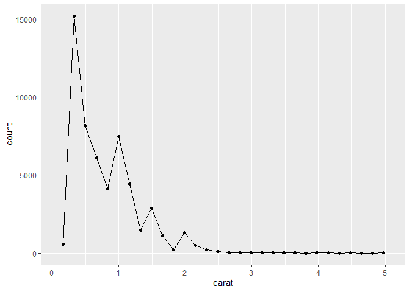
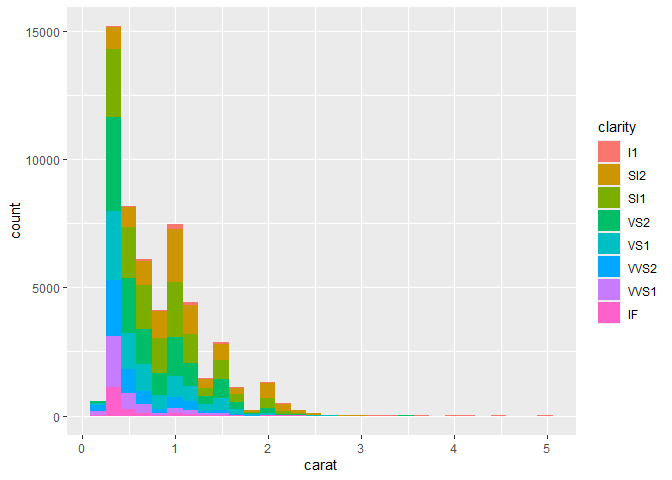
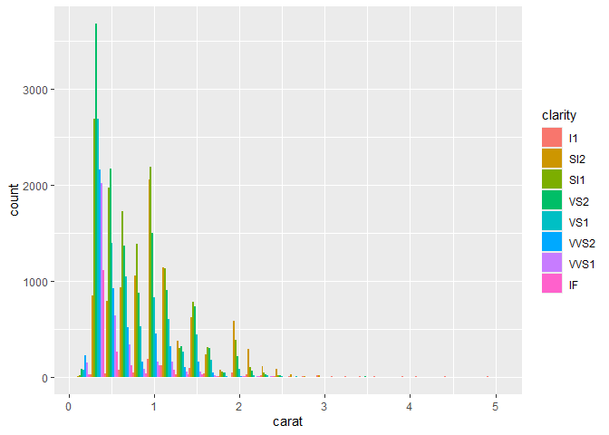

DSC1105_FA3_Rodillas
================
Rodillas
2025-02-28

# 1. Create a histogram on the diamonds dataset

``` r
library(ggplot2)
library(tidyverse)
```

    ## ── Attaching core tidyverse packages ──────────────────────── tidyverse 2.0.0 ──
    ## ✔ dplyr     1.1.4     ✔ readr     2.1.5
    ## ✔ forcats   1.0.0     ✔ stringr   1.5.1
    ## ✔ lubridate 1.9.4     ✔ tibble    3.2.1
    ## ✔ purrr     1.0.2     ✔ tidyr     1.3.1
    ## ── Conflicts ────────────────────────────────────────── tidyverse_conflicts() ──
    ## ✖ dplyr::filter() masks stats::filter()
    ## ✖ dplyr::lag()    masks stats::lag()
    ## ℹ Use the conflicted package (<http://conflicted.r-lib.org/>) to force all conflicts to become errors

``` r
diamonds
```

    ## # A tibble: 53,940 × 10
    ##    carat cut       color clarity depth table price     x     y     z
    ##    <dbl> <ord>     <ord> <ord>   <dbl> <dbl> <int> <dbl> <dbl> <dbl>
    ##  1  0.23 Ideal     E     SI2      61.5    55   326  3.95  3.98  2.43
    ##  2  0.21 Premium   E     SI1      59.8    61   326  3.89  3.84  2.31
    ##  3  0.23 Good      E     VS1      56.9    65   327  4.05  4.07  2.31
    ##  4  0.29 Premium   I     VS2      62.4    58   334  4.2   4.23  2.63
    ##  5  0.31 Good      J     SI2      63.3    58   335  4.34  4.35  2.75
    ##  6  0.24 Very Good J     VVS2     62.8    57   336  3.94  3.96  2.48
    ##  7  0.24 Very Good I     VVS1     62.3    57   336  3.95  3.98  2.47
    ##  8  0.26 Very Good H     SI1      61.9    55   337  4.07  4.11  2.53
    ##  9  0.22 Fair      E     VS2      65.1    61   337  3.87  3.78  2.49
    ## 10  0.23 Very Good H     VS1      59.4    61   338  4     4.05  2.39
    ## # ℹ 53,930 more rows

``` r
p <- ggplot(data = diamonds) +
  geom_histogram(mapping = aes(x = carat))

#Using the layer function

p$layers
```

    ## [[1]]
    ## mapping: x = ~carat 
    ## geom_bar: na.rm = FALSE, orientation = NA
    ## stat_bin: binwidth = NULL, bins = NULL, na.rm = FALSE, orientation = NA, pad = FALSE
    ## position_stack

The p\$layer function examines the aspects of the current plot that was
created using geom_histogram. It shows the aspects used for layer
function

``` r
ggplot(data = diamonds) +
  layer(
    mapping = aes(x = carat), 
    stat = "bin",             
    geom = "bar",             
    position = "stack",     
    params = list(bins = 30, na.rm = FALSE)
  )
```

<!-- -->

Using the layer function, this is a similar plot that provides the same
amount of data visualization for the carat of the diamonds.

# 2. Modify your histogram code so that it uses a different geom

``` r
ggplot(data = diamonds) +
  layer(
    mapping = aes(x = carat), 
    stat = "bin",             
    geom = "point",             
    position = "stack",     
  ) +
  layer(
    mapping = aes(x = carat), 
    stat = "bin",             
    geom = "line",             
    position = "stack",     
  )
```

    ## `stat_bin()` using `bins = 30`. Pick better value with `binwidth`.
    ## `stat_bin()` using `bins = 30`. Pick better value with `binwidth`.

<!-- -->

Utilizing the two layer functions combined, I have created a line plot
with points on the major changes of the carat of the diamonds.

# 3. In your histogram (the one plotted with bars that you created in question 1), add an aesthetic mapping from one of the factor variables

``` r
ggplot(data = diamonds) +
  layer(
    mapping = aes(x = carat, fill = clarity), 
    stat = "bin",             
    geom = "bar",              
    position = "stack",       
    data = NULL,
    params = list(bins = 30, na.rm = FALSE) 
  ) + scale_fill_hue(name = waiver())
```

<!-- -->

I added fill = clarity to easily differentiate each clarity of the
diamond. Using the scale_fill_hue function gave me options to how I
would like the color aesthetics of my plot.

# 4. What is the default position adjustment for a histogram? Try changing the position adjustment in the histogram you created

``` r
ggplot(data = diamonds) +
  layer(
    mapping = aes(x = carat, fill = clarity), 
    stat = "bin",             
    geom = "bar",              
    position = "dodge",       
    data = NULL,
    params = list(bins = 30, na.rm = FALSE) 
  ) + scale_fill_hue(name = waiver())
```

<!-- -->

By looking at most bar graphs, it is safe to assume that the default
position would be stack, as it shows different data with similar data
points as one, kind of like “stacking” with each other. This is another
example for a position called dodge, it shows the different data side by
side, so it looks like every data is different from each other.
