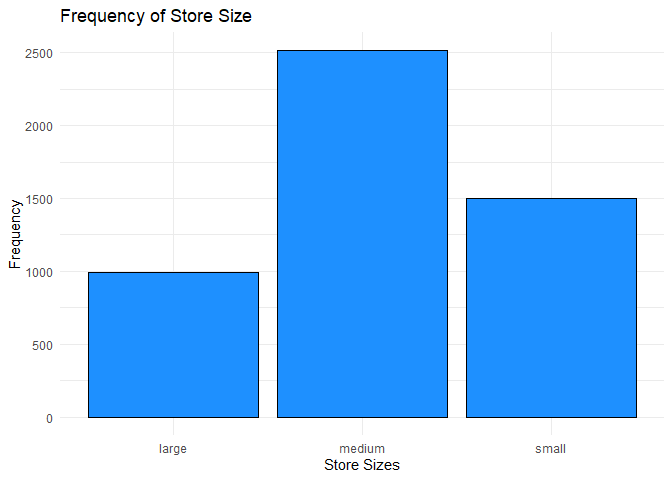

DSC1105_FA5_Rodillas
================
Rodillas
2025-05-02

``` r
sales_data <- read.csv("E:/Downloads/store_sales_data.csv")

head(sales_data)
```

    ##   day_of_week promo holiday store_size sales_count
    ## 1           6     0       0     medium          18
    ## 2           3     0       0     medium          13
    ## 3           4     0       0      large          24
    ## 4           6     1       0      small          16
    ## 5           2     0       0     medium          11
    ## 6           4     0       1     medium          13

Display summary statistics and variable types.

``` r
summary(sales_data)
```

    ##   day_of_week        promo           holiday        store_size       
    ##  Min.   :0.000   Min.   :0.0000   Min.   :0.0000   Length:5000       
    ##  1st Qu.:1.000   1st Qu.:0.0000   1st Qu.:0.0000   Class :character  
    ##  Median :3.000   Median :0.0000   Median :0.0000   Mode  :character  
    ##  Mean   :2.985   Mean   :0.3012   Mean   :0.0956                     
    ##  3rd Qu.:5.000   3rd Qu.:1.0000   3rd Qu.:0.0000                     
    ##  Max.   :6.000   Max.   :1.0000   Max.   :1.0000                     
    ##   sales_count   
    ##  Min.   : 0.00  
    ##  1st Qu.: 7.00  
    ##  Median :12.00  
    ##  Mean   :13.73  
    ##  3rd Qu.:18.00  
    ##  Max.   :61.00

``` r
str(sales_data)
```

    ## 'data.frame':    5000 obs. of  5 variables:
    ##  $ day_of_week: int  6 3 4 6 2 4 4 6 1 2 ...
    ##  $ promo      : int  0 0 0 1 0 0 0 1 1 1 ...
    ##  $ holiday    : int  0 0 0 0 0 1 0 0 0 0 ...
    ##  $ store_size : chr  "medium" "medium" "large" "small" ...
    ##  $ sales_count: int  18 13 24 16 11 13 12 34 19 8 ...

The dataset includes 5 variables, all of which takes the sales data of a
store. 4 of which, namely day of weel, promo, holiday, and sales_count
is in an int type, while the store_size is a character, determining
store sizes for the sale.

Distribution of sales_count

``` r
ggplot(sales_data, aes(x=sales_count))+
  geom_histogram(fill="dodgerblue", color = "black", bins = 30)+
  labs(title = "Distribution of Sales Count", 
       x = "Sales Count", 
       y = "Count Distribution")
```

<!-- -->

**Figure 1.** Distrubution of Sales Count

Figure 1 shows the distribution of sales count based on each frequency.
The highest peak of the graph is around the sales count of 10, peaking
at around 600 times. The most consistent number of sales ranges at
around 0 to 20.

Frequency of each store_size

``` r
ggplot(sales_data, aes(x=store_size))+
  geom_bar(fill="dodgerblue", color = "black")+
  labs(title = "Frequency of Store Size", 
       x = "Store Sizes", 
       y = "Frequency")
```

<!-- -->

**Figure 2.** Frequency of Store Sizes

Figure 2 shows each frequency of the store sizes in data. Half of the
stores in data are in medium sizes, which counts to about 2,500. It is
then followed by small store sizes, which frequency is aroung 1,500.
Lastly, possibly due to its costing, large store sizes are the smallest
in frequency, which counts to around 1,000.

``` r
sales_data$promo_holiday <- with(sales_data, ifelse(promo == 1 & holiday == 1, "Both",
                              ifelse(promo == 1, "Promo only",
                              ifelse(holiday == 1, "Holiday only", "Neither"))))

library(ggplot2)

ggplot(sales_data, aes(x = promo_holiday)) +
  geom_bar(aes(y = (after_stat(count)) / sum(after_stat(count))), fill = "dodgerblue") +
  scale_y_continuous(labels = scales::percent) +
  labs(title = "Proportion of Days by Promo and Holiday",
       x = "Promo/Holiday Category",
       y = "Proportion")
```

<!-- -->

**Figure 3.** Proportion of Days with Promo and Holiday

Figure 3 visualizes the proportion of whether a day is a Holiday, a
Promo, Neither, or both at the same time. Most of the days in store, at
around 60% - 70%, neither promo or holiday happens, which means items
are most likely sold by their original prices. On the other hand, around
25-30% of the store days usually have promo only. On the other hand,
around 5% of the days have the same date as holidays. Although it
happens only a few days a year, around 2% of the store sales happens
when there is both promo and holiday available. This usually happens
during Christmas or Thanksgiving season for example.

## Fit a Poisson Regression Model

``` r
 pois_rm1 <- glm(sales_count ~ day_of_week + promo + holiday + store_size, data = sales_data, family = "poisson") 

summary(pois_rm1)
```

    ## 
    ## Call:
    ## glm(formula = sales_count ~ day_of_week + promo + holiday + store_size, 
    ##     family = "poisson", data = sales_data)
    ## 
    ## Coefficients:
    ##                   Estimate Std. Error z value Pr(>|z|)    
    ## (Intercept)       2.994849   0.009422  317.86   <2e-16 ***
    ## day_of_week       0.051115   0.001918   26.65   <2e-16 ***
    ## promo             0.410843   0.007817   52.55   <2e-16 ***
    ## holiday          -0.330938   0.014935  -22.16   <2e-16 ***
    ## store_sizemedium -0.697088   0.008296  -84.03   <2e-16 ***
    ## store_sizesmall  -1.395564   0.011868 -117.59   <2e-16 ***
    ## ---
    ## Signif. codes:  0 '***' 0.001 '**' 0.01 '*' 0.05 '.' 0.1 ' ' 1
    ## 
    ## (Dispersion parameter for poisson family taken to be 1)
    ## 
    ##     Null deviance: 25307.2  on 4999  degrees of freedom
    ## Residual deviance:  5142.7  on 4994  degrees of freedom
    ## AIC: 26507
    ## 
    ## Number of Fisher Scoring iterations: 4

Show the model summary and interpret the coefficients:

Looking at the summary above, it shows the total value of sales using 5
predictors present. From the summary, we can interpret many estimates.

When there is a **promotion available**, based on the model, the **log
sales skyrockets to about 41%, increasing the sales count to almost
half**, most likely because customers usually sees a bargain to what the
prices usually is. On the other hand, holidays in store reduces the
amount in log sales at about -33.09%.

On the cases of how large the stores are, using large stores as our
basis to interpretation, the model shows that the **log sales of a store
plummets to about -69.7% on medium-sized stores**, due to the fact the
the store holds a smaller amount of people each day, and most likely
have less stores available as well. In the cases of **smaller store
sizes**, the **sales nosedive** even more, **plummeting to around
-139.55% in total count of sales**.

## Assess Model Fit

Check for overdispersion (e.g., deviance/df \> 1.5)

``` r
disp_check <- deviance(pois_rm1)/df.residual(pois_rm1)

disp_check
```

    ## [1] 1.029785

Since the dispersion statistic shows a value of 1.029785, it shows a
good fit being close to 1, and since the DS is NOT \> 1.5, the model
shows no dispersion.

Since there is no dispersion present, no need to compare models, and/or
suggest a remedy.

## Make Predictions

``` r
sales_pred1 <- tibble(
  store_size = "medium",
  day_of_week = 1,
  promo = 1,
  holiday = 0
)

prediction <- predict(pois_rm1, newdata = sales_pred1, type = "response")

prediction
```

    ##        1 
    ## 15.79542

Based on the prediction given, the sales of that day with the given
conditions is 15.79542, or about a 15 to 16 items to be sold.

``` r
sales_pred2 <- tibble(
  store_size = "large",
  day_of_week = 7,
  promo = 0,
  holiday = 1
)

prediction2 <- predict(pois_rm1, newdata = sales_pred2, type = "response")

prediction2
```

    ##        1 
    ## 20.52657

On the other hand, based on the given prediction, using the values of
the predictors, a large store may give up a 20.52657, or around a 20 to
21 items sold.

On the given context, the model shows a good fit to creating predictions
within a given context. In this dataset, it shows the importance of
having a larger store to creating a better sales value. Looking at the
summary above, although a promo provides around a 41% sales boost, and
holidays give a -33% dip to sales, the increase of a large size store
still provides a more sales possibility of around 1/4 of that in medium.
Because of the -67% decrease of a medium-sized store, the strongest
predictor variable to a store sales per day is still the size.

## Reflection

Looking at the available data and interpretation above, given that the
dispersion statistic shows a close value to around 1, the Poisson
Regression Model is a strong predictor when it comes to predicting
countable data, which in this case, is the sales count of stores.
Through studying this new kind of distribution, I have gained a deeper
appreciation to its practical utility to real-life scenarios.

Looking at the fitting of the model, Poission regression model is a
perfect indicator of prediction to countable data, which in this case
has a dispersion statistic of 1.029785. This suggests that the model’s
assumption is reasonably met, and there is no overdispersion in the
data. In addition, the null deviance also shows that the predictors
given provides a meaningful improvement to the model.

With the coefficient at around a -1.396, the strongest (or in this case,
the weakest for the sales) is actually the store size. The large
negative value indicates an extremely large drop in expected sales when
looking at the large in comparison to small-sized stores. Because of
this, it provides a really strong impact on the overall sales of stores.
But with more predictor data, possibly taking into account the cost to
run a large sized store could take into effect in real life scenarios.
In contrast, the promo variable had the strongest positive effect, with
a coefficient of 0.411, indicating that promotional activities
significantly increase sales. Although, despite showing a strong
performance on the overall data set, one problem of a Poisson regression
is the lack of answer to outside factors that affects the sales. In
real-world scenarios, there are a lot of factors that affects the sales
of a store. One example of which is the weather conditions, which could
partially affect store sales on certain parts of a month. Another
example of which is the factor of having another store nearby that
affects the competition, or factor of the location and prices of sales.
These factors can certainly introduce overdispersion, which could lead
to an unfit model. Additionally, the model presumes a log-linear
relationship between predictors and the response, which may oversimplify
complex interactions and nonlinear effects present in actual business
environments. These limitations highlight the need for caution when
applying statistical models directly to real-world decision-making
without ongoing validation.
