SA1_DSC1105_Rodillas
================
Rodillas
2025-03-17

## Unit 1: Univariate Data Analysis

### 1. Load the dataset and summarize its structure.

``` r
ecom_df <- read.csv("E:/Downloads/EDA_Ecommerce_Assessment.csv")

head(ecom_df)
```

    ##   Customer_ID Gender Age Browsing_Time Purchase_Amount Number_of_Items
    ## 1           1   Male  65         46.55          231.81               6
    ## 2           2 Female  19         98.80          472.78               8
    ## 3           3   Male  23         79.48          338.44               1
    ## 4           4   Male  45         95.75           37.13               7
    ## 5           5   Male  46         33.36          235.53               3
    ## 6           6 Female  43         83.39          123.92               9
    ##   Discount_Applied Total_Transactions       Category Satisfaction_Score
    ## 1               17                 16       Clothing                  2
    ## 2               15                 43          Books                  4
    ## 3               28                 31    Electronics                  1
    ## 4               43                 27 Home & Kitchen                  5
    ## 5               10                 33          Books                  3
    ## 6                5                 29       Clothing                  2

### 2. Create histograms and boxplots to visualize the distribution of Purchase_Amount, Number_of_Items, and Satisfaction_Score.

``` r
histo_PA <- ggplot(data = ecom_df, mapping = aes(x = Purchase_Amount))+
  geom_histogram(
    bins = 50,
    binwidth = 20,
    fill = "orange",
    color = "black"
  )+
  labs(
    title = "Histogram for \n Purchase Amount",
    x = "Purchase",
    y = "Count"
  )


histo_NI <- ggplot(ecom_df, aes(Number_of_Items))+
  geom_histogram(
    bins = 10,
    binwidth = 1,
    fill = "dodgerblue",
    color = "black"
  ) +
  labs(
    title = "Histogram for \n Number of Items",
    x = "Number of Items",
    y = "Count"
  )


histo_SS <- ggplot(ecom_df, aes(Satisfaction_Score))+
  geom_histogram(
    bins = 1,
    binwidth = 1,
    fill = "violet",
    color = "black"
  ) +
  labs(
    title = "Histogram for \n Satisfaction Score",
    x = "Satisfaction Score",
    y = "Count"
  )
    


histo_PA +histo_NI +histo_SS
```

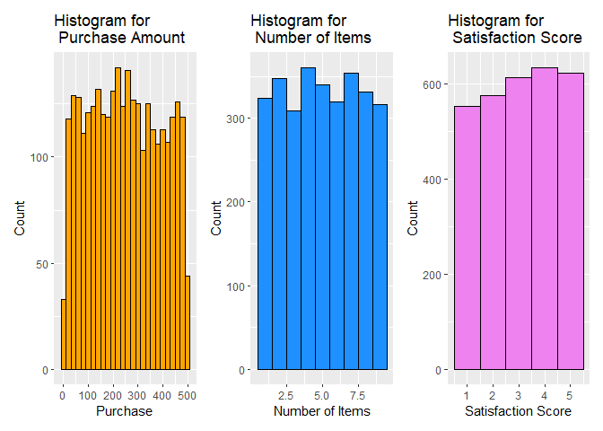<!-- -->

###### Figure 1. Series of Histograms (Purchase, Number of Items, Satisfaction Score)

The series of histogram figures above shows three components, the
**purchase**, **number of items**, as well as **satisfaction score** of
the customers in the e-commerce. The Purchase section shows a normally
distributed histogram where the purchase at peaks at around the range of
250 with over 180 in count. It resembles a bell curve as both the 0 and
the 500 purchases are on the lowest of the count. On the other hand, the
Number of Items bought in an e-commerce are also normally distributed
where most numbers range in around 300. Lastly, the satisfaction score
shows the rating of the customers in the e-commerce, peaking at the
score of 4 which is closely followed by 5s and 3s, showing signs of
satisfaction for the customers.

``` r
box_PA <- ggplot(data = ecom_df, mapping = aes(y = Purchase_Amount))+
  geom_boxplot(
    fill = "orange",
    color = "black"
  ) +
  labs(
    title = "Boxplot for \n Purchase Amount",
    x = "Purchase Amount",
    y = "Count"
  )

box_NI <- ggplot(data = ecom_df, mapping = aes(y = Number_of_Items))+
  geom_boxplot(
    fill = "dodgerblue",
    color = "black"
  ) +
  labs(
    title = "Boxplot for \n Number of Items",
    x = "Number of Items",
    y = "Count"
  )


box_SS <- ggplot(data = ecom_df, mapping = aes(y = Satisfaction_Score))+
  geom_boxplot(
    fill = "violet",
    color = "black"
  ) +
  labs(
    title = "Boxplot for \n Satisfaction Score",
    x = "Satisfaction Score",
    y = "Count"
  )

box_PA + box_NI +box_SS
```

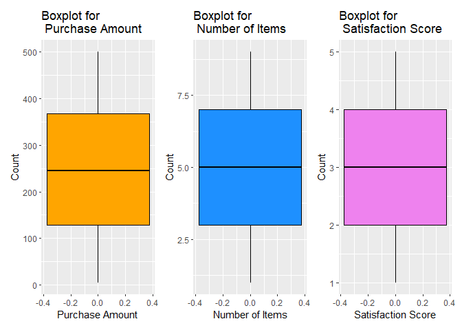<!-- -->

###### Figure 2. Series of Box Plot (Purchase, Number of Items, Satisfaction Score)

Similar to the earlier figure above, this figure 2 shows the similar
components **(Satisfaction Score, Number of Items, and Purchase
Amount)**. Since all three of the components have a similar count to
every value of its range, the mean of all three are right around the
middle of those ranges.

### 3. Compute measures of central tendency (mean, median, mode) and spread (variance, standard deviation, IQR) for Purchase_Amount.

``` r
###central Tendency
mean_PA <- mean(ecom_df$Purchase_Amount)
median_PA <- median(ecom_df$Purchase_Amount)
mode_PA <- names(sort(table(ecom_df$Purchase_Amount), decreasing = TRUE))[1]

###Spread

variance_PA <- var(ecom_df$Purchase_Amount)
sd_PA <- sd(ecom_df$Purchase_Amount)
iqr_PA <- IQR(ecom_df$Purchase_Amount)

summary_table <- tibble(
  Statistic = c("Mean", "Median", "Mode", "Variance", "Standard Deviation", "IQR"),
  Value = c(mean_PA, median_PA, mode_PA, variance_PA, sd_PA, iqr_PA)
)

summary_table
```

    ## # A tibble: 6 × 2
    ##   Statistic          Value           
    ##   <chr>              <chr>           
    ## 1 Mean               247.96254       
    ## 2 Median             245.09          
    ## 3 Mode               29.33           
    ## 4 Variance           19845.9862093515
    ## 5 Standard Deviation 140.875782905904
    ## 6 IQR                238.505

### 4. Compare the distribution of Browsing_Time and Purchase_Amount across different Gender groups using density plots.

``` r
Dens_BT_Gender <- ggplot(data = ecom_df, mapping = aes(x = Browsing_Time, fill = Gender)) +
  geom_density(alpha = 0.5) + 
  labs(title = "Density Plot of Browsing Time by Gender",
       x = "Browsing Time",
       y = "Density"
       )

Dens_BT_Gender
```

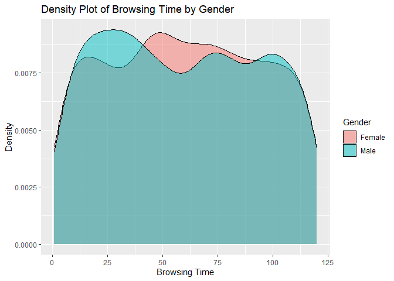<!-- -->

###### Figure 3. Density Plot of Browsing Time by Gender

Figure 3 provides a density plot that **visualizes per gender based on
the browsing time**. The blue density, which shows the male relation,
shows that the purchase amount has a higher density on the 0 to 25
minute range, dipping at the 50 mark, and showing a slight up and down
on the curve, representing that their **browsing time invertly relates
their purchases**. On the other hand, the female shows a slight peak
towards the middle of the 0 to 25 range, increases yet again at its peak
of around 50 minute mark, and gradually slows down.

``` r
Dens_PA_Gender <- ggplot(data = ecom_df, mapping = aes(x = Purchase_Amount, fill = Gender)) +
  geom_density(alpha = 0.5) + 
  labs(title = "Density Plot of Purchase Amount by Gender",
       x = "Purchase Amount",
       y = "Density"
       )

Dens_PA_Gender
```

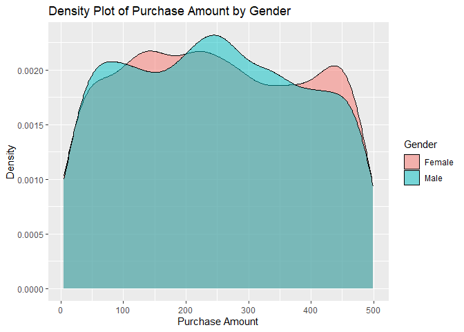<!-- -->

###### Figure 4. Density Plot of Purchasing Amount by Gender

Figure 4 shows a density plot that visualizes per gender based on the
purchase amount. The male shows a relatively high peak at 50 purchases,
which gradually slows down, and rises back yet again at the 250 mark. On
the other hand, the female has a low density on the 0 mark but rises up
in between 100 to 200, having a downward slope up until 400, which then
rises up yet again.

### 5. Apply a logarithmic or square root transformation on Browsing_Time and evaluate changes in skewness.

``` r
log_BT <- log1p(ecom_df$Browsing_Time)
log_skew <- skewness(log_BT)

sqrt_BT <- sqrt(ecom_df$Browsing_Time)
sqrt_skew <- skewness(sqrt_BT)

skew_table <- data.frame(
  Transformation = c("Log", "Square Root"),
  Skewness = c(log_skew, sqrt_skew)
)

print(skew_table)
```

    ##   Transformation   Skewness
    ## 1            Log -1.2183734
    ## 2    Square Root -0.4768351

### 6. Fit a simple linear regression model predicting Purchase_Amount based on Browsing_Time. Interpret the results.

``` r
model <- lm(Purchase_Amount ~ Browsing_Time, data = ecom_df)

summary(model)
```

    ## 
    ## Call:
    ## lm(formula = Purchase_Amount ~ Browsing_Time, data = ecom_df)
    ## 
    ## Residuals:
    ##      Min       1Q   Median       3Q      Max 
    ## -244.867 -120.473   -2.946  118.246  254.069 
    ## 
    ## Coefficients:
    ##                Estimate Std. Error t value Pr(>|t|)    
    ## (Intercept)   252.65596    5.17524  48.820   <2e-16 ***
    ## Browsing_Time  -0.07839    0.07501  -1.045    0.296    
    ## ---
    ## Signif. codes:  0 '***' 0.001 '**' 0.01 '*' 0.05 '.' 0.1 ' ' 1
    ## 
    ## Residual standard error: 140.9 on 2998 degrees of freedom
    ## Multiple R-squared:  0.0003642,  Adjusted R-squared:  3.075e-05 
    ## F-statistic: 1.092 on 1 and 2998 DF,  p-value: 0.2961

The data above shows the **residuals and the coefficients of the
purchase amount** in accordance to the **browsing time**.

First, for the coefficient, there are two main components, the intercept
and the browsing time. The intercept shows the estimated coefficients
when the browsing time of a customer in an e-commerce is 0. Looking at
the estimate, since the intercept shows a value of 252.66, which can be
translated into dollars (\$), it could be argued that **most customers
that comes into the platform already have a set idea of the items they
want to consume**.

On the other hand the coefficient for browsing time shows the gradual
change of purchase amount in line with the change in browsing time.
Since the estimate shows a value of -0.07, it means that the more the
customer spends time within the platform, the less the purchase amount
they bring, but in this case, super minimal in consideration.

But looking on the p-value for the browsing time, it shows that the
**p-value \> 0.05**, meaning that there is really no significant
relationship between the browsing time and the purchase amount of the
consumer. Rather looking at it through the p-value, the r squared is a
good representation for the fit of the model. Since the value is closer
to zero, it shows that the **model is not a good fit** to analyze the
two components.

### 7. Use ggplot2 (or equivalent) to create scatter plots and regression lines.

``` r
scatter_SLR <- ggplot(data = ecom_df, mapping = aes(x = Browsing_Time, y = Purchase_Amount)) +
  geom_point(alpha = 0.5) +
  geom_smooth(method = lm) +
  labs(
    title = "Plot for the Relationship Purchase Amount \n in Terms of Browsing Time",
    x = "Browsing Time",
    y = "Purchase Amount"
  )

scatter_SLR 
```

    ## `geom_smooth()` using formula = 'y ~ x'

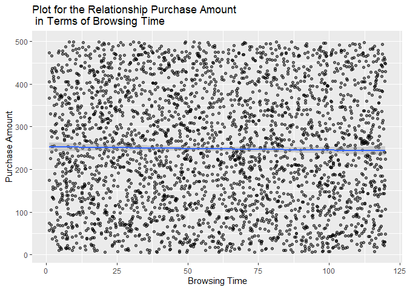<!-- -->

###### Figure 5. Scatter Plot for the Relationship Purchase Amount in Terms of Browsing Time

Figure 5 visualizes the scatter plot fit with a linear model to visibly
show the pattern. Figure 5 minimally shows the relation as the **linear
regression line stays only at the center**.

## Unit 2: Bivariate Data Analysis

### 8. Create scatter plots to explore the relationship between Purchase_Amount and Number_of_Items.

``` r
scatter_PA_NI <- ggplot(data = ecom_df, mapping = aes(x = Number_of_Items, y = Purchase_Amount)) +
  geom_point(alpha = 0.1) +
  scale_x_continuous(limits = c(1,10), breaks = 1:10) +
  labs(
    title = "Plot for the Relationship Purchase Amount \n in Terms of Number of Items",
    x = "Number of Items",
    y = "Purchase Amount"
  )

scatter_PA_NI 
```

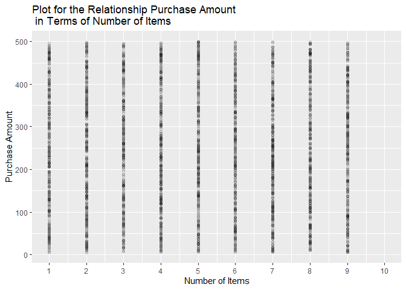<!-- -->

###### Figure 6. Scatter Plot for the Relationship between the Purchase Amount in terms of Number of Items

The scatter plot above shows the relationship between the purchase
amount in terms of number of items the customers buy. Upon inspecting
the graph, it shows that from items 1 to 9, the **purchase amount does
not change much** because of an influx in data, as well as the items in
variety of prices.

### 9. Fit a polynomial regression model for Purchase_Amount and Browsing_Time and compare it with a simple linear model.

``` r
BTsquared <- ecom_df$Browsing_Time^2

model2 <- lm(Purchase_Amount ~ Browsing_Time + BTsquared , data = ecom_df)
summary(model2)
```

    ## 
    ## Call:
    ## lm(formula = Purchase_Amount ~ Browsing_Time + BTsquared, data = ecom_df)
    ## 
    ## Residuals:
    ##     Min      1Q  Median      3Q     Max 
    ## -245.47 -120.41   -3.49  118.25  255.85 
    ## 
    ## Coefficients:
    ##                 Estimate Std. Error t value Pr(>|t|)    
    ## (Intercept)   249.715045   7.986151  31.269   <2e-16 ***
    ## Browsing_Time   0.064709   0.305301   0.212    0.832    
    ## BTsquared      -0.001182   0.002445  -0.484    0.629    
    ## ---
    ## Signif. codes:  0 '***' 0.001 '**' 0.01 '*' 0.05 '.' 0.1 ' ' 1
    ## 
    ## Residual standard error: 140.9 on 2997 degrees of freedom
    ## Multiple R-squared:  0.0004422,  Adjusted R-squared:  -0.0002249 
    ## F-statistic: 0.6629 on 2 and 2997 DF,  p-value: 0.5154

This is the summary for the polynomial regression model for the purchase
amount and browsing time. Upon adding another degree for the polynomial
regression, the browsing time coefficient turned into positive in
contrast to the simple linear’s negative. In addition, the multiple **R
squared of 0.00044** have increased from 0.0003, meaning that in
numerical perspective, the polynomial regression is a better fit than
the simple linear. Although that is the case, it still shows that the
**model is still underfit**.

For easier comparison, I applied both models in a scatterplot with two
models.

``` r
scatter_SLR2 <- ggplot(data = ecom_df, mapping = aes(x = Browsing_Time, y = Purchase_Amount)) +
  geom_point(alpha = 0.5) +
  geom_smooth(aes(color = "Simple Linear Regression"), method = "lm", formula = y ~ x, se = FALSE)+
  geom_smooth(aes(color = "Polynomial Regression"),method ="lm", formula = y ~ poly(x,2), se = FALSE) +
  labs(
    title = "Plot for the Relationship Purchase Amount \n in Terms of Browsing Time \n (Regression: Polynomial vs Simple Linear)",
    x = "Browsing Time",
    y = "Purchase Amount",
    color = "Model"
  ) +
scale_color_manual(values = c("Simple Linear Regression" = "blue", "Polynomial Regression" = "red"))


scatter_SLR2 
```

<!-- -->

###### Figure 7. Plot for the Relationship Purchase Amount in Terms of Browsing Time (Regression: Polynomial vs Simple Linear)

Similar to figure 6, the plot shows a scatter with a polynomial
regression model added. Looking at the comparison, the **polynomial
regression** accounts for a better variable changes in the data, as
shown in a more **better curve**. Although that is the case, both models
are still fairly similar which could be the **case of underfitting** for
both. Still, it shows that the Polynomial Regression is a better model
for the data than the Simple Linear Regression.

### 10. Apply LOESS (Locally Estimated Scatterplot Smoothing) to Purchase_Amount vs. Browsing_Time and visualize the results.

``` r
scatter_Loess <- ggplot(data = ecom_df, mapping = aes(x = Browsing_Time, y = Purchase_Amount)) +
  geom_point(alpha = 0.3) +
  geom_smooth(method = "loess", se = TRUE, span = 0.45)+
  labs(
    title = "Plot for the Relationship Purchase Amount \n in Terms of Browsing Time (LOESS)",
    x = "Browsing Time",
    y = "Purchase Amount"
  ) 

scatter_Loess 
```

    ## `geom_smooth()` using formula = 'y ~ x'

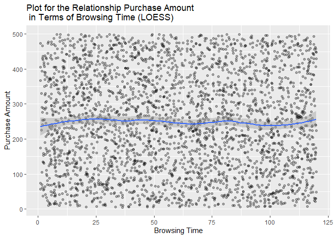<!-- -->

###### Figure 8. Plot for the Relationship Purchase Amount in Terms of Browsing Time (LOESS)

The **Loess** shows the most promise by far. On the visualization, the
LOESS shows a better curve turn out since it takes into account more
data and shows a better pattern. On the trade off, the LOESS has a more
significant effect on noise. Upon analysis of the graph, it shows a
slight upward from the 0 to 25 browsing time, and a small decrease from
around 80 to 100. Although it still does not show the best pattern, the
LOESS shows promise and a better understanding rather than a straight
line.

### 11. Compare robust regression methods (Huber or Tukey regression) with ordinary least squares (OLS).

``` r
#using the original OLS (model)
#this is for huber
model_huber <- rlm(Purchase_Amount ~ Browsing_Time, data = ecom_df)

summary(model_huber)
```

    ## 
    ## Call: rlm(formula = Purchase_Amount ~ Browsing_Time, data = ecom_df)
    ## Residuals:
    ##      Min       1Q   Median       3Q      Max 
    ## -244.818 -120.331   -2.848  118.291  254.289 
    ## 
    ## Coefficients:
    ##               Value    Std. Error t value 
    ## (Intercept)   252.6462   5.3363    47.3448
    ## Browsing_Time  -0.0803   0.0773    -1.0378
    ## 
    ## Residual standard error: 176.9 on 2998 degrees of freedom

Comparing the two in a side by side visualization,

``` r
plot_lm <- ggplot(ecom_df, aes(x = Browsing_Time, y = Purchase_Amount)) +
  geom_point(alpha = 0.5) +
  geom_smooth(method = "lm", color = "dodgerblue", se = FALSE) +
  labs(
    title = "Ordinary Least Squares",
    x = "Browsing Time",
    y = "Purchase Amount"
  )


plot_rlm <- ggplot(ecom_df, aes(x = Browsing_Time, y = Purchase_Amount)) +
  geom_point(alpha = 0.5) +
  geom_smooth(method = "rlm", color = "pink", se = FALSE) +
  labs(
    title = "RLS (Huber Regression)",
    x = "Browsing Time",
    y = "Purchase Amount"
  )

plot_lm + plot_rlm
```

    ## `geom_smooth()` using formula = 'y ~ x'
    ## `geom_smooth()` using formula = 'y ~ x'

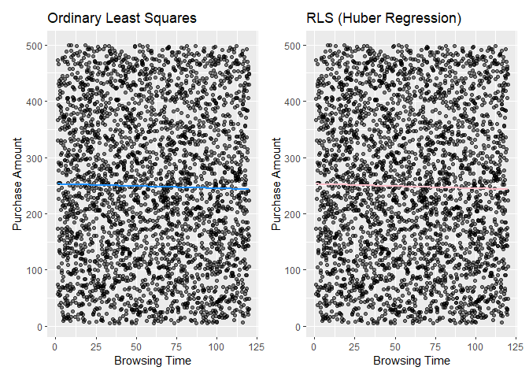<!-- -->

###### Figure 9. Side by Side Comparison of Ordinary Least Squares and Robust Regression Method

Looking on the side by side comparison of the OLS vs the Robust
Regression, it can be shown that the RLS is more sensitive to noise,
thus showing a little more curvature than the Ordinary Least Squares.
But inspecting, they still provide a rather similar outcome and still
has lapses on their underfitting, as it does not significantly change
the outcome of the analysis.

## Unit 3: Trivariate/Hypervariate Data Analysis

### 12. Explore interaction effects between Browsing_Time and Category on Purchase_Amount using interaction plots.

``` r
inter_BT_PA <- ggplot(ecom_df, mapping = aes(x = Browsing_Time, y= Purchase_Amount, color = Category)) +
  geom_smooth(span = 1, se = FALSE)

inter_BT_PA 
```

    ## `geom_smooth()` using method = 'loess' and formula = 'y ~ x'

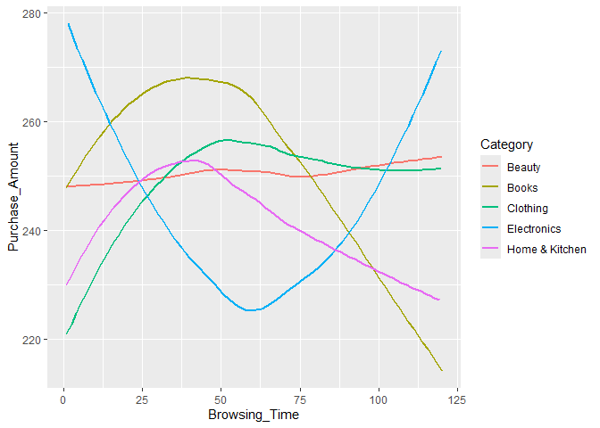<!-- -->

###### Figure 10. Interaction Plot between categories

This is an interaction plot between the categories of the item. Using a
relatively high span of 1, it can digress a more smoother approach to
curves and show the purchase amount based on the browsing time per
category. Although all of the categories hover around the 220 to 280
range, it could probe some healthy analysis to the data.

Upon inspection, **books** have a higher purchase amount on the lower
browsing time and a higher peak between 25 to 50, suggesting that most
customers know which genre or type of book they are looking for, and are
more probably purchase with a book in mind.

On the other hand, **clothing** has a curved pattern that shows a higher
purchase amount as browsing time also increases, suggesting that
customers consume better with time to compare clothing alternatives.

For the **electronics**, it has a U-shaped curve suggesting that most
people have a higher probability of purchase when they either know what
they will buy, or have longer time to decide on their purchase. For the
**beauty and home and kitchen** categories, both shows a gradual
downward slope after initial rise of purchasing amount.

``` r
inter2_BT_PA <- ggplot(ecom_df, mapping = aes(x = Browsing_Time, y= Purchase_Amount, color = Category)) +
  geom_smooth(method = lm, se = FALSE) +
  geom_point(alpha = 0.3)

inter2_BT_PA 
```

    ## `geom_smooth()` using formula = 'y ~ x'

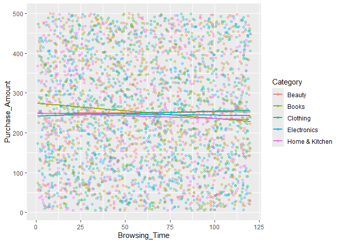<!-- -->

###### Figure 11. Scatter Plot with Simple Linear Regression Line per Category

On a more linear approach, using a linear method on the geom_smooth to
check the interaction effects, it could be seen that the line is less
sensitive to noise as most of the purchases hovers around the 250 to 300
dollar amount range.

### 13. Create coplots of Purchase_Amount against Browsing_Time for different levels of Category.

``` r
coplot_BT_PA <- ggplot(ecom_df, aes(x = Browsing_Time, y = Purchase_Amount, color = Category)) +
  geom_point(alpha = 0.5) +
  geom_smooth(method = "lm", se = FALSE) +
  facet_wrap(~ Category) 

coplot_BT_PA
```

    ## `geom_smooth()` using formula = 'y ~ x'

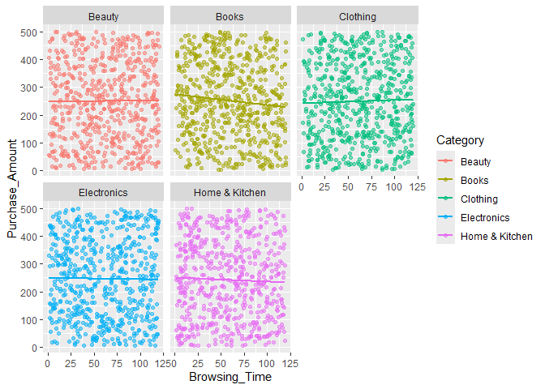<!-- -->

###### Figure 12. Coplots per Category Given

### 14. Use level plots or contour plots to visualize relationships between Browsing_Time, Number_of_Items, and Purchase_Amount.

``` r
level_BT_NI <- ggplot(ecom_df, aes(x = Browsing_Time, y = Number_of_Items, fill = Purchase_Amount)) +
  geom_tile() +
  scale_fill_gradient(low = "dodgerblue", high = "violet") +
  labs(
    title ="Level Plot on the Relationship between Browsing Time, Number of Items, and Purchase Amount"
  )

level_BT_NI
```

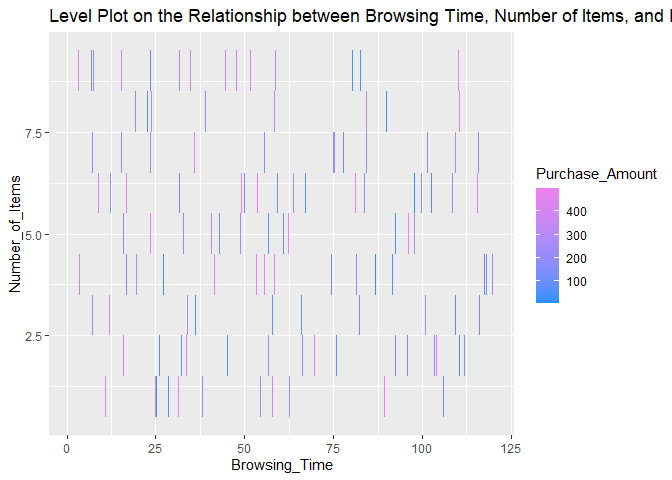<!-- -->

###### Figure 13. Level Plot on the Relationship between Browsing Time, Number of Items, and Purchase Amount

The figure above shows a scattered pattern, with no clear linear
relationship within each other. The level plot only shows vertical
clusters, suggesting that customers tend to browse for specific
durations regardless of how many items they purchase.

### 15. Perform multiple regression with Purchase_Amount as the dependent variable and Browsing_Time, Number_of_Items, and Satisfaction_Score as predictors. Perform model selection and assess variable importance.

``` r
mult_model <- lm(Purchase_Amount ~ Browsing_Time + Number_of_Items + Satisfaction_Score, data = ecom_df)
summary(mult_model)
```

    ## 
    ## Call:
    ## lm(formula = Purchase_Amount ~ Browsing_Time + Number_of_Items + 
    ##     Satisfaction_Score, data = ecom_df)
    ## 
    ## Residuals:
    ##      Min       1Q   Median       3Q      Max 
    ## -250.668 -120.856   -2.846  118.899  255.664 
    ## 
    ## Coefficients:
    ##                     Estimate Std. Error t value Pr(>|t|)    
    ## (Intercept)        261.34993    9.24929  28.256   <2e-16 ***
    ## Browsing_Time       -0.07954    0.07504  -1.060    0.289    
    ## Number_of_Items     -0.78321    1.00497  -0.779    0.436    
    ## Satisfaction_Score  -1.53871    1.83444  -0.839    0.402    
    ## ---
    ## Signif. codes:  0 '***' 0.001 '**' 0.01 '*' 0.05 '.' 0.1 ' ' 1
    ## 
    ## Residual standard error: 140.9 on 2996 degrees of freedom
    ## Multiple R-squared:  0.0007932,  Adjusted R-squared:  -0.0002073 
    ## F-statistic: 0.7928 on 3 and 2996 DF,  p-value: 0.4978

``` r
stepwise_model <- step(mult_model, direction = "both")
```

    ## Start:  AIC=29691.89
    ## Purchase_Amount ~ Browsing_Time + Number_of_Items + Satisfaction_Score
    ## 
    ##                      Df Sum of Sq      RSS   AIC
    ## - Number_of_Items     1     12056 59482958 29691
    ## - Satisfaction_Score  1     13966 59484867 29691
    ## - Browsing_Time       1     22299 59493201 29691
    ## <none>                            59470902 29692
    ## 
    ## Step:  AIC=29690.5
    ## Purchase_Amount ~ Browsing_Time + Satisfaction_Score
    ## 
    ##                      Df Sum of Sq      RSS   AIC
    ## - Satisfaction_Score  1     13479 59496437 29689
    ## - Browsing_Time       1     21541 59504498 29690
    ## <none>                            59482958 29691
    ## + Number_of_Items     1     12056 59470902 29692
    ## 
    ## Step:  AIC=29689.18
    ## Purchase_Amount ~ Browsing_Time
    ## 
    ##                      Df Sum of Sq      RSS   AIC
    ## - Browsing_Time       1     21676 59518113 29688
    ## <none>                            59496437 29689
    ## + Satisfaction_Score  1     13479 59482958 29691
    ## + Number_of_Items     1     11569 59484867 29691
    ## 
    ## Step:  AIC=29688.27
    ## Purchase_Amount ~ 1
    ## 
    ##                      Df Sum of Sq      RSS   AIC
    ## <none>                            59518113 29688
    ## + Browsing_Time       1     21676 59496437 29689
    ## + Satisfaction_Score  1     13614 59504498 29690
    ## + Number_of_Items     1     10822 59507290 29690

``` r
summary(stepwise_model)
```

    ## 
    ## Call:
    ## lm(formula = Purchase_Amount ~ 1, data = ecom_df)
    ## 
    ## Residuals:
    ##      Min       1Q   Median       3Q      Max 
    ## -242.933 -119.268   -2.873  119.237  251.647 
    ## 
    ## Coefficients:
    ##             Estimate Std. Error t value Pr(>|t|)    
    ## (Intercept)  247.963      2.572   96.41   <2e-16 ***
    ## ---
    ## Signif. codes:  0 '***' 0.001 '**' 0.01 '*' 0.05 '.' 0.1 ' ' 1
    ## 
    ## Residual standard error: 140.9 on 2999 degrees of freedom

Using the step-wise model, we can assess the most reduced model that
allows us to find the best fit model for the data given. Looking at the
stepwise model, we aim to find the lowest AIC (which is in this case,
29691.89) since lower AIC means better model fit. Reducing all three, it
shows that the AIC is still on a relatively high value of 29688.27,
which means none of these predictors provides a good explanation of the
variation of the purchase amount. This could be explained by a number of
reasons, one of which is the high variety of purchase amount on
different levels, and does not provide us a substantiable pattern.
