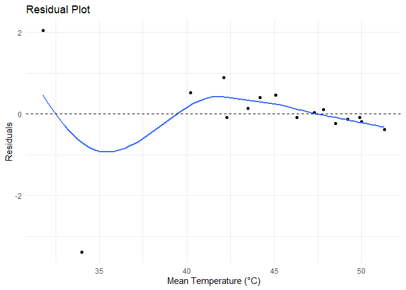
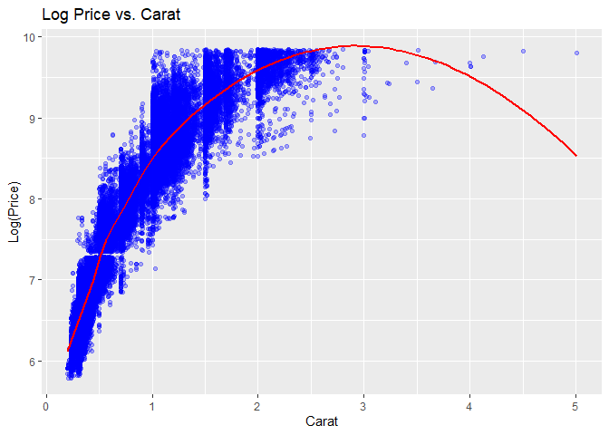
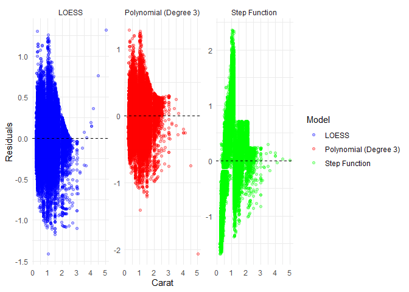

DSC1105_FA4_Rodillas
================
Rodillas
2025-03-06

## 1. Mortality by Latitude

``` r
library(ggplot2)
library(dplyr)
library(tidyr)

mortality_df <- read.csv("E:/Downloads/mortality_by_latitude.csv")


mortality_df <- mortality_df %>%
  mutate(log_mortality = log(mortality_index - min(mortality_index) + 1)) 
mort_plot <- ggplot(data = mortality_df, mapping = aes(x = temperature, y = mortality_index)) +
  geom_point() +
  geom_smooth(method = "loess", se = FALSE)

mort_plot
```

    ## `geom_smooth()` using formula = 'y ~ x'

<!-- -->

The plot of the mortality index shows a hollow-up line curve using a
LOESS smoother. The graphs shows a slight decrease after the intial data
but dips back into a sharp increase. This means that the graph suggests
a nonlinear relationship.

``` r
model <- lm(log_mortality ~ temperature, data = mortality_df)
mortality_df$residuals <- resid(model)

ggplot(mortality_df, aes(x = temperature, y = residuals)) +
  geom_point() +
  geom_smooth(method = "loess", se = FALSE) +
  geom_hline(yintercept = 0, linetype = "dashed") +
  labs(title = "Residual Plot",
       x = "Mean Temperature (°C)",
       y = "Residuals") +
  theme_minimal()
```

    ## `geom_smooth()` using formula = 'y ~ x'

<!-- -->

By plotting the residuals of the data, the graph shows wave-like pattern
around the zero. Although the residual data surrounds itself around the
zero-axis, the few residuals around the lower temperature acts as the
reason for its structure.

## 2. Diamonds long price

``` r
diamonds
```

    ## # A tibble: 53,940 × 10
    ##    carat cut       color clarity depth table price     x     y     z
    ##    <dbl> <ord>     <ord> <ord>   <dbl> <dbl> <int> <dbl> <dbl> <dbl>
    ##  1  0.23 Ideal     E     SI2      61.5    55   326  3.95  3.98  2.43
    ##  2  0.21 Premium   E     SI1      59.8    61   326  3.89  3.84  2.31
    ##  3  0.23 Good      E     VS1      56.9    65   327  4.05  4.07  2.31
    ##  4  0.29 Premium   I     VS2      62.4    58   334  4.2   4.23  2.63
    ##  5  0.31 Good      J     SI2      63.3    58   335  4.34  4.35  2.75
    ##  6  0.24 Very Good J     VVS2     62.8    57   336  3.94  3.96  2.48
    ##  7  0.24 Very Good I     VVS1     62.3    57   336  3.95  3.98  2.47
    ##  8  0.26 Very Good H     SI1      61.9    55   337  4.07  4.11  2.53
    ##  9  0.22 Fair      E     VS2      65.1    61   337  3.87  3.78  2.49
    ## 10  0.23 Very Good H     VS1      59.4    61   338  4     4.05  2.39
    ## # ℹ 53,930 more rows

``` r
ggplot(data = diamonds, mapping = aes(x = carat, y = log(price))) +
  geom_point(alpha = 0.3, color = "blue") + 
  geom_smooth(method = "loess", span = 0.45, color = "red", se = FALSE) +
  labs(title = "Log Price vs. Carat",
       x = "Carat",
       y = "Log(Price)")
```

    ## `geom_smooth()` using formula = 'y ~ x'

<!-- -->

After trying out different spans, the span value that works the most
plays around the 0.4 to 0.5. Based on the graph, the log price of the
diamonds increases as the carat increases until the 2 to 3 carat point.
As it increases, it dips down on a lower side again, which could be
because of other external factors such as rarity and demand.

## 3. Comparing the fit

``` r
loess_model <- loess(log(price) ~ carat, data = diamonds, span = 0.5)
diamonds$loess_resid <- residuals(loess_model)

poly_model <- lm(log(price) ~ poly(carat, 3), data = diamonds)
diamonds$poly_resid <- residuals(poly_model)

step_model <- lm(log(price) ~ cut(carat, breaks = 5), data = diamonds)
diamonds$step_resid <- residuals(step_model)

diamonds_long <- diamonds %>%
  select(carat, loess_resid, poly_resid, step_resid) %>%
  pivot_longer(cols = c(loess_resid, poly_resid, step_resid), 
               names_to = "Model", values_to = "Residuals") %>%
  mutate(Model = factor(Model, levels = c("loess_resid", "poly_resid", "step_resid"),
                        labels = c("LOESS", "Polynomial (Degree 3)", "Step Function")))

ggplot(diamonds_long, aes(x = carat, y = Residuals, color = Model)) +
  geom_point(alpha = 0.3) +
  geom_hline(yintercept = 0, linetype = "dashed") +
  scale_color_manual(values = c("LOESS" = "blue", 
                                "Polynomial (Degree 3)" = "red", 
                                "Step Function" = "green")) +
  facet_wrap(~Model, scales = "free_y") +
  labs(y = "Residuals",
       x = "Carat",
       color = "Model") +
  theme_minimal()
```

<!-- -->

Comparing the three residual plots the LOESS smoother still shows the
most faithful and is a better fit. The residuals appear more evenly
spread and shows no obvious pattern unlike the two others.
