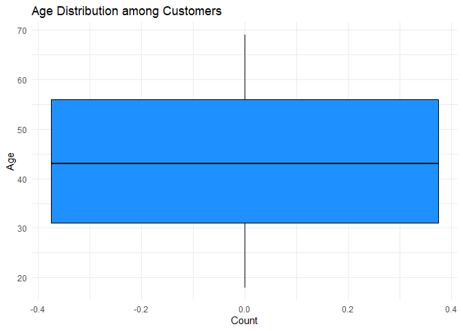
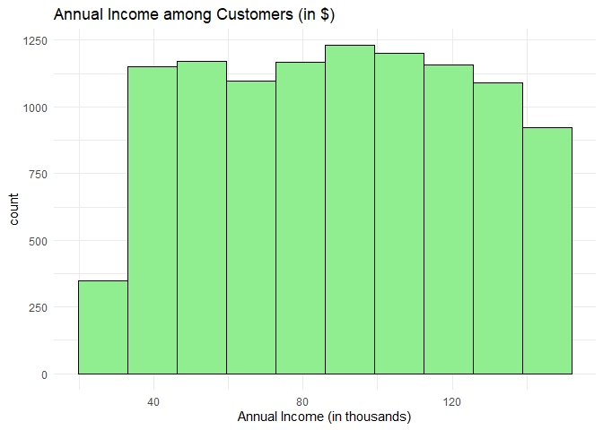
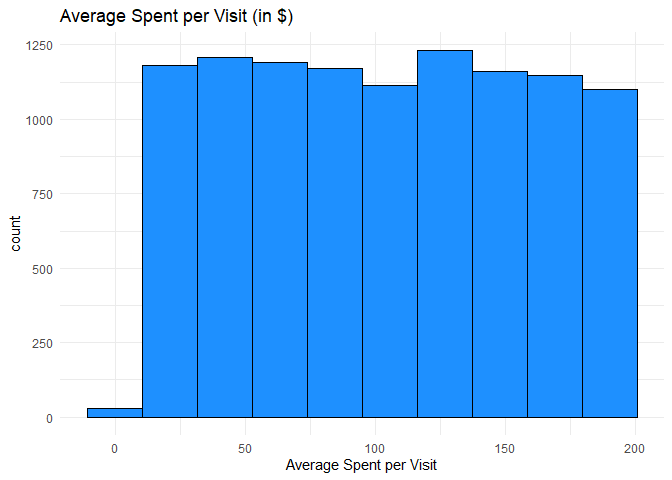

DSC1105_FA6
================
Rodillas
2025-05-05

# FA 6 - Customer Segmentation in an E-commerce Business

``` r
cs_data <- read.csv("E:/Downloads/customer_segmentation.csv")

head(cs_data)
```

    ##   Customer.ID Age Annual.Income..K.. Gender Product.Category.Purchased
    ## 1           1  56                106 Female                    Fashion
    ## 2           2  69                 66 Female                       Home
    ## 3           3  46                110   Male                    Fashion
    ## 4           4  32                 50   Male                Electronics
    ## 5           5  60                 73 Female                     Others
    ## 6           6  25                 48   Male                       Home
    ##   Average.Spend.per.Visit.... Number.of.Visits.in.Last.6.Months
    ## 1                    163.4528                                16
    ## 2                    163.0205                                31
    ## 3                    104.5413                                29
    ## 4                    110.0646                                26
    ## 5                    142.2546                                38
    ## 6                    106.7621                                22
    ##   Customer.Segment
    ## 1  Premium Shopper
    ## 2   Budget Shopper
    ## 3   Budget Shopper
    ## 4  Regular Shopper
    ## 5  Regular Shopper
    ## 6   Budget Shopper

## Data Visualizations

``` r
glimpse(cs_data)
```

    ## Rows: 10,532
    ## Columns: 8
    ## $ Customer.ID                       <int> 1, 2, 3, 4, 5, 6, 7, 8, 9, 10, 11, 1…
    ## $ Age                               <int> 56, 69, 46, 32, 60, 25, 38, 56, 36, …
    ## $ Annual.Income..K..                <int> 106, 66, 110, 50, 73, 48, 100, 131, …
    ## $ Gender                            <chr> "Female", "Female", "Male", "Male", …
    ## $ Product.Category.Purchased        <chr> "Fashion", "Home", "Fashion", "Elect…
    ## $ Average.Spend.per.Visit....       <dbl> 163.45276, 163.02050, 104.54128, 110…
    ## $ Number.of.Visits.in.Last.6.Months <int> 16, 31, 29, 26, 38, 22, 20, 33, 34, …
    ## $ Customer.Segment                  <chr> "Premium Shopper", "Budget Shopper",…

``` r
ggplot(data = cs_data, mapping = aes(y = Age)) +
  geom_boxplot( fill = "dodgerblue", color = "black") +
  labs(title = "Age Distribution among Customers", x = "Count")
```

<!-- -->

**Figure 1.** Age Distribution

``` r
ggplot(data =  cs_data, mapping = aes(x = Annual.Income..K..)) +
  geom_histogram( fill = "lightgreen", color = "black", bins = 10)+
  labs(title = "Annual Income among Customers (in $)", x = "Annual Income (in thousands)")
```

<!-- -->

**Figure 2.** Annual Income Distribution

``` r
ggplot(data =  cs_data, mapping = aes(x =Average.Spend.per.Visit....)) +
  geom_histogram( fill = "dodgerblue", color = "black", bins = 10)+
  labs(title = "Average Spent per Visit (in $)", x = "Average Spent per Visit")
```

<!-- -->

**Figure 3.** Average Spent per Visit

``` r
colSums(is.na(cs_data))
```

    ##                       Customer.ID                               Age 
    ##                                 0                                 0 
    ##                Annual.Income..K..                            Gender 
    ##                                 0                                 0 
    ##        Product.Category.Purchased       Average.Spend.per.Visit.... 
    ##                                 0                                 0 
    ## Number.of.Visits.in.Last.6.Months                  Customer.Segment 
    ##                                 0                                 0

Looking at missing values, it appears that the dataset does not have
one. Let’s double check it through the unique values.

Looking at the table of values, there seems to have no missing values
that are replaced by zero, therefore, there is no missing values for the
dataset.

``` r
ggplot(data = cs_data, mapping = aes(x = Customer.Segment, fill = Customer.Segment )) +
  geom_bar(color = "black") +
  geom_text(stat = "count", aes(label = after_stat(count)), vjust = -0.5) +
  labs(title= "Customer Segmentation per Shopper", x = "Customer Segment", y = "Count")
```

<!-- -->

**Figure 4.** Count per Type of Customer (Customer Segmentation)

The figure above shows the three types of customers and their count
based on each one. Although all types of customers are almost equal in
count, the highest among the three seems to be the regular shopper, with
the bar exceeding well over 3000 at 3533. It is closely followed by the
Budget Shopper with a 15 count difference at 3516. Although the lowest,
the premium shopper is well above the 3000s as well, totaling to 3483.

``` r
dummy <- dummyVars("~Product.Category.Purchased", data = cs_data)

prod_dummy <- data.frame(predict(dummy, newdata = cs_data))

cs_data_OH <- cbind(cs_data, prod_dummy)

cs_data_OH$Product.Category.Purchased <- NULL

head(cs_data_OH)
```

    ##   Customer.ID Age Annual.Income..K.. Gender Average.Spend.per.Visit....
    ## 1           1  56                106 Female                    163.4528
    ## 2           2  69                 66 Female                    163.0205
    ## 3           3  46                110   Male                    104.5413
    ## 4           4  32                 50   Male                    110.0646
    ## 5           5  60                 73 Female                    142.2546
    ## 6           6  25                 48   Male                    106.7621
    ##   Number.of.Visits.in.Last.6.Months Customer.Segment
    ## 1                                16  Premium Shopper
    ## 2                                31   Budget Shopper
    ## 3                                29   Budget Shopper
    ## 4                                26  Regular Shopper
    ## 5                                38  Regular Shopper
    ## 6                                22   Budget Shopper
    ##   Product.Category.PurchasedBooks Product.Category.PurchasedElectronics
    ## 1                               0                                     0
    ## 2                               0                                     0
    ## 3                               0                                     0
    ## 4                               0                                     1
    ## 5                               0                                     0
    ## 6                               0                                     0
    ##   Product.Category.PurchasedFashion Product.Category.PurchasedHome
    ## 1                                 1                              0
    ## 2                                 0                              1
    ## 3                                 1                              0
    ## 4                                 0                              0
    ## 5                                 0                              0
    ## 6                                 0                              1
    ##   Product.Category.PurchasedOthers
    ## 1                                0
    ## 2                                0
    ## 3                                0
    ## 4                                0
    ## 5                                1
    ## 6                                0

## Data Preprocessing

``` r
dummy <- dummyVars("~Product.Category.Purchased", data = cs_data)

prod_dummy <- data.frame(predict(dummy, newdata = cs_data))

cs_data_OH <- cbind(cs_data, prod_dummy)

cs_data_OH$Product.Category.Purchased <- NULL

head(cs_data_OH)
```

    ##   Customer.ID Age Annual.Income..K.. Gender Average.Spend.per.Visit....
    ## 1           1  56                106 Female                    163.4528
    ## 2           2  69                 66 Female                    163.0205
    ## 3           3  46                110   Male                    104.5413
    ## 4           4  32                 50   Male                    110.0646
    ## 5           5  60                 73 Female                    142.2546
    ## 6           6  25                 48   Male                    106.7621
    ##   Number.of.Visits.in.Last.6.Months Customer.Segment
    ## 1                                16  Premium Shopper
    ## 2                                31   Budget Shopper
    ## 3                                29   Budget Shopper
    ## 4                                26  Regular Shopper
    ## 5                                38  Regular Shopper
    ## 6                                22   Budget Shopper
    ##   Product.Category.PurchasedBooks Product.Category.PurchasedElectronics
    ## 1                               0                                     0
    ## 2                               0                                     0
    ## 3                               0                                     0
    ## 4                               0                                     1
    ## 5                               0                                     0
    ## 6                               0                                     0
    ##   Product.Category.PurchasedFashion Product.Category.PurchasedHome
    ## 1                                 1                              0
    ## 2                                 0                              1
    ## 3                                 1                              0
    ## 4                                 0                              0
    ## 5                                 0                              0
    ## 6                                 0                              1
    ##   Product.Category.PurchasedOthers
    ## 1                                0
    ## 2                                0
    ## 3                                0
    ## 4                                0
    ## 5                                1
    ## 6                                0

Using the one hot encoded dataset,

``` r
cs_data_OH$Gender_Label <- ifelse(cs_data_OH$Gender == "Male", 1, 0)
cs_data_OH$Gender <- NULL
cs_data_OH$Customer.ID <- NULL

cs_df <- cs_data_OH
cs_df <- cs_df %>% rename(Gender = Gender_Label)

head(cs_df)
```

    ##   Age Annual.Income..K.. Average.Spend.per.Visit....
    ## 1  56                106                    163.4528
    ## 2  69                 66                    163.0205
    ## 3  46                110                    104.5413
    ## 4  32                 50                    110.0646
    ## 5  60                 73                    142.2546
    ## 6  25                 48                    106.7621
    ##   Number.of.Visits.in.Last.6.Months Customer.Segment
    ## 1                                16  Premium Shopper
    ## 2                                31   Budget Shopper
    ## 3                                29   Budget Shopper
    ## 4                                26  Regular Shopper
    ## 5                                38  Regular Shopper
    ## 6                                22   Budget Shopper
    ##   Product.Category.PurchasedBooks Product.Category.PurchasedElectronics
    ## 1                               0                                     0
    ## 2                               0                                     0
    ## 3                               0                                     0
    ## 4                               0                                     1
    ## 5                               0                                     0
    ## 6                               0                                     0
    ##   Product.Category.PurchasedFashion Product.Category.PurchasedHome
    ## 1                                 1                              0
    ## 2                                 0                              1
    ## 3                                 1                              0
    ## 4                                 0                              0
    ## 5                                 0                              0
    ## 6                                 0                              1
    ##   Product.Category.PurchasedOthers Gender
    ## 1                                0      0
    ## 2                                0      0
    ## 3                                0      1
    ## 4                                0      1
    ## 5                                1      0
    ## 6                                0      1

``` r
continuous_vars <- c("Age","Annual.Income..K..", "Average.Spend.per.Visit....")
cs_df[continuous_vars] <- scale(cs_df[continuous_vars])

head(cs_df)
```

    ##          Age Annual.Income..K.. Average.Spend.per.Visit....
    ## 1  0.8323972          0.4886923                 1.083217431
    ## 2  1.7046295         -0.6737348                 1.075302088
    ## 3  0.1614492          0.6049350                 0.004477697
    ## 4 -0.7778779         -1.1387056                 0.105615627
    ## 5  1.1007764         -0.4703100                 0.695052913
    ## 6 -1.2475415         -1.1968270                 0.045143784
    ##   Number.of.Visits.in.Last.6.Months Customer.Segment
    ## 1                                16  Premium Shopper
    ## 2                                31   Budget Shopper
    ## 3                                29   Budget Shopper
    ## 4                                26  Regular Shopper
    ## 5                                38  Regular Shopper
    ## 6                                22   Budget Shopper
    ##   Product.Category.PurchasedBooks Product.Category.PurchasedElectronics
    ## 1                               0                                     0
    ## 2                               0                                     0
    ## 3                               0                                     0
    ## 4                               0                                     1
    ## 5                               0                                     0
    ## 6                               0                                     0
    ##   Product.Category.PurchasedFashion Product.Category.PurchasedHome
    ## 1                                 1                              0
    ## 2                                 0                              1
    ## 3                                 1                              0
    ## 4                                 0                              0
    ## 5                                 0                              0
    ## 6                                 0                              1
    ##   Product.Category.PurchasedOthers Gender
    ## 1                                0      0
    ## 2                                0      0
    ## 3                                0      1
    ## 4                                0      1
    ## 5                                1      0
    ## 6                                0      1

``` r
set.seed(777)
trIndex <- createDataPartition(cs_df$Customer.Segment, p = 0.8, list = FALSE)

train_data <-cs_df[trIndex,]
test_data <- cs_df[-trIndex,]

train_data$Customer.Segment <- as.factor(train_data$Customer.Segment)
test_data$Customer.Segment <- as.factor(test_data$Customer.Segment)
```

``` r
segment_mlr <- multinom(Customer.Segment ~ ., data = train_data)
```

    ## # weights:  36 (22 variable)
    ## initial  value 9258.005757 
    ## iter  10 value 9245.675149
    ## iter  20 value 9244.914834
    ## final  value 9244.787668 
    ## converged

``` r
summary(segment_mlr)
```

    ## Call:
    ## multinom(formula = Customer.Segment ~ ., data = train_data)
    ## 
    ## Coefficients:
    ##                 (Intercept)          Age Annual.Income..K..
    ## Premium Shopper  0.08437645 -0.009997162        -0.02774574
    ## Regular Shopper  0.08724842  0.019027742        -0.01181484
    ##                 Average.Spend.per.Visit.... Number.of.Visits.in.Last.6.Months
    ## Premium Shopper                 0.004262613                      -0.004174999
    ## Regular Shopper                -0.038144101                      -0.002604276
    ##                 Product.Category.PurchasedBooks
    ## Premium Shopper                      -0.1257710
    ## Regular Shopper                      -0.1110741
    ##                 Product.Category.PurchasedElectronics
    ## Premium Shopper                           0.035254839
    ## Regular Shopper                           0.009677838
    ##                 Product.Category.PurchasedFashion
    ## Premium Shopper                         0.1624252
    ## Regular Shopper                         0.1314808
    ##                 Product.Category.PurchasedHome Product.Category.PurchasedOthers
    ## Premium Shopper                    0.009008803                      0.003458642
    ## Regular Shopper                   -0.022979684                      0.080143521
    ##                      Gender
    ## Premium Shopper -0.03303063
    ## Regular Shopper -0.08346985
    ## 
    ## Std. Errors:
    ##                 (Intercept)        Age Annual.Income..K..
    ## Premium Shopper  0.05805990 0.02675104         0.02668372
    ## Regular Shopper  0.05790405 0.02665584         0.02658819
    ##                 Average.Spend.per.Visit.... Number.of.Visits.in.Last.6.Months
    ## Premium Shopper                  0.02671655                       0.002658069
    ## Regular Shopper                  0.02662827                       0.002648670
    ##                 Product.Category.PurchasedBooks
    ## Premium Shopper                      0.05380634
    ## Regular Shopper                      0.05345330
    ##                 Product.Category.PurchasedElectronics
    ## Premium Shopper                            0.05544966
    ## Regular Shopper                            0.05556788
    ##                 Product.Category.PurchasedFashion
    ## Premium Shopper                        0.05613430
    ## Regular Shopper                        0.05629718
    ##                 Product.Category.PurchasedHome Product.Category.PurchasedOthers
    ## Premium Shopper                     0.05475098                       0.05391241
    ## Regular Shopper                     0.05496059                       0.05296988
    ##                     Gender
    ## Premium Shopper 0.05353138
    ## Regular Shopper 0.05335121
    ## 
    ## Residual Deviance: 18489.58 
    ## AIC: 18529.58

**Interpretation:**

The multinomial logistic regression model was used to predict customer
segments based on various features. Looking at the summary provided, it
is noticeable that both age and the annual income slightly affects the
likelihood of being a premium shopper, which could be explained by the
lack of implementation of these shopping membership in the earlier
years, as well as the annual income, which changes the budget of the
household.

In terms of shopping behavior, a higher average spend per visit is
positively associated with being a Premium Shopper but negatively
associated with being a Regular Shopper. Interestingly, customers who
frequently purchase fashion products are more likely to be either
Premium or Regular Shoppers, with the strongest positive effect seen in
the Premium segment.

All in all, the model provides a reasonable understanding of how
demographic and purchase behavior features influence customer
segmentation.

Looking at the **Residual Deviance**, it shows a value at **18492.06**, which is
not usually concerning, but only shows a moderate fit for the model. In addition, 
the **AIC** values at **18529.58**

Using glmnet for regularization,

``` r
X <- model.matrix(Customer.Segment ~ ., data = train_data)[, -1]  
y <- train_data$Customer.Segment

cv_fit <- cv.glmnet(X, y, family = "multinomial", alpha = 0,nfolds = 5)

best_lambda <- cv_fit$lambda.min
cat("Best lambda (regularization strength):", best_lambda, "\n")
```

    ## Best lambda (regularization strength): 10.37523

Using the value for the best lambda,

``` r
final_model <- glmnet(X, y, family = "multinomial", alpha = 0,lambda = best_lambda)
```

## Model Evaluation

``` r
test_X <- model.matrix(Customer.Segment ~ ., data = test_data)[, -1]
test_y <- test_data$Customer.Segment

pred_labels <- predict(final_model, newx = test_X, type = "class")
pred_probs  <- predict(final_model, newx = test_X, type = "response")


conf_matrix <- confusionMatrix(as.factor(pred_labels), as.factor(test_y))
```

    ## Warning in levels(reference) != levels(data): longer object length is not a
    ## multiple of shorter object length

    ## Warning in confusionMatrix.default(as.factor(pred_labels), as.factor(test_y)):
    ## Levels are not in the same order for reference and data. Refactoring data to
    ## match.

``` r
print(conf_matrix)
```

    ## Confusion Matrix and Statistics
    ## 
    ##                  Reference
    ## Prediction        Budget Shopper Premium Shopper Regular Shopper
    ##   Budget Shopper              72              65              74
    ##   Premium Shopper              0               0               0
    ##   Regular Shopper            631             631             632
    ## 
    ## Overall Statistics
    ##                                           
    ##                Accuracy : 0.3344          
    ##                  95% CI : (0.3143, 0.3551)
    ##     No Information Rate : 0.3354          
    ##     P-Value [Acc > NIR] : 0.5449          
    ##                                           
    ##                   Kappa : -0.0012         
    ##                                           
    ##  Mcnemar's Test P-Value : <2e-16          
    ## 
    ## Statistics by Class:
    ## 
    ##                      Class: Budget Shopper Class: Premium Shopper
    ## Sensitivity                         0.1024                 0.0000
    ## Specificity                         0.9009                 1.0000
    ## Pos Pred Value                      0.3412                    NaN
    ## Neg Pred Value                      0.6668                 0.6694
    ## Prevalence                          0.3340                 0.3306
    ## Detection Rate                      0.0342                 0.0000
    ## Detection Prevalence                0.1002                 0.0000
    ## Balanced Accuracy                   0.5016                 0.5000
    ##                      Class: Regular Shopper
    ## Sensitivity                         0.89518
    ## Specificity                         0.09793
    ## Pos Pred Value                      0.33369
    ## Neg Pred Value                      0.64929
    ## Prevalence                          0.33539
    ## Detection Rate                      0.30024
    ## Detection Prevalence                0.89976
    ## Balanced Accuracy                   0.49656

``` r
metrics <- conf_matrix$byClass[, c("Precision", "Recall", "F1")]
metrics <- as.data.frame(metrics)

kable(metrics, digits = 3, caption = "Precision, Recall, and F1-score by Class")
```

|                        | Precision | Recall |    F1 |
|:-----------------------|----------:|-------:|------:|
| Class: Budget Shopper  |     0.341 |  0.102 | 0.158 |
| Class: Premium Shopper |        NA |  0.000 |    NA |
| Class: Regular Shopper |     0.334 |  0.895 | 0.486 |

Precision, Recall, and F1-score by Class

Looking at the values for each of the Precision, Recall, and F1-score,
it shows a struggle to provide substantial predictions each class. Even
with the highest precision, the model only predicts at about **36%** for the
**budget shoppers**, and only having 10% of them completely identified, with
that, it is reasonable reason why the **F1 is sub 20%**. In addition,
although the **regular shopper** has a lower precision at **33.7%**, it still
makes up for the **identification of actual regular shopper** at **90.7%**. This
means that the modelstrongly favors predicting Regular Shoppers. It
identifies most of them, but its precision is relatively low, indicating
it’s also over-predicting this class. On the other hand, the **model
completely ignored premium shoppers**.

## Refinement

Doing the interaction features,

``` r
cs_df <- cs_df %>%
  mutate(Customer.Segment = make.names(Customer.Segment))
levels(cs_df$Customer.Segment)
```

    ## NULL

``` r
inter_cs_df <- cs_df %>%
  mutate(
    Income_Age_Ratio = Annual.Income..K.. / (Age + 1),
    Spend_Visit_Interaction = Average.Spend.per.Visit.... * Number.of.Visits.in.Last.6.Months,
    Income_Spend_Ratio = Annual.Income..K.. / (Average.Spend.per.Visit.... + 1)
  )

table(inter_cs_df$Customer.Segment)
```

    ## 
    ##  Budget.Shopper Premium.Shopper Regular.Shopper 
    ##            3516            3483            3533

``` r
set.seed(777)

train_index <- createDataPartition(inter_cs_df$Customer.Segment, p = 0.8, list = FALSE)
train_data <- inter_cs_df[train_index, ]
test_data <- inter_cs_df[-train_index, ]

y_train <- factor(train_data$Customer.Segment)
y_test <- factor(test_data$Customer.Segment, levels = levels(y_train))

x_train <- model.matrix(~ . - 1, data = train_data[, -which(names(train_data) == "Customer.Segment")])
x_test <- model.matrix(~ . - 1, data = test_data[, -which(names(test_data) == "Customer.Segment")])

x_train <- x_train[, colnames(x_train) != "(Intercept)"]
x_test <- x_test[, colnames(x_test) != "(Intercept)"]
```

``` r
registerDoParallel(cores = 4) 

alp <- seq(0, 1, by = 0.2)  
cv_results <- list()

for (i in alp) {
  cat("\nFitting model with alpha =", i, "...")
  
  cv_fit <- cv.glmnet(
    x = x_train,
    y = y_train,
    family = "multinomial",
    type.measure = "class",
    alpha = i,
    nfolds = 5,
    parallel = TRUE
  )
  
  cv_results[[paste0("alpha_", i)]] <- cv_fit
  cat("Done. Minimum error:", min(cv_fit$cvm), "\n")
}
```

    ## 
    ## Fitting model with alpha = 0 ...Done. Minimum error: 0.672956 
    ## 
    ## Fitting model with alpha = 0.2 ...Done. Minimum error: 0.67082 
    ## 
    ## Fitting model with alpha = 0.4 ...Done. Minimum error: 0.66014 
    ## 
    ## Fitting model with alpha = 0.6 ...Done. Minimum error: 0.65658 
    ## 
    ## Fitting model with alpha = 0.8 ...Done. Minimum error: 0.6599027 
    ## 
    ## Fitting model with alpha = 1 ...Done. Minimum error: 0.6610894

``` r
best_alpha <- alp[which.min(sapply(cv_results, function(x) min(x$cvm)))]
best_model <- cv_results[[paste0("alpha_", best_alpha)]]

pred_class <- predict(best_model, newx = x_test, type = "class", s = "lambda.min")
pred_prob <- predict(best_model, newx = x_test, type = "response", s = "lambda.min")

conf_mat <- table(Predicted = pred_class, Actual = y_test)
accuracy <- sum(diag(conf_mat))/sum(conf_mat)

cat("\nBest alpha:", best_alpha,
    "\nTest Accuracy:", round(accuracy, 4),
    "\nMinimum CV Error:", min(best_model$cvm))
```

    ## 
    ## Best alpha: 0.6 
    ## Test Accuracy: 0.3264 
    ## Minimum CV Error: 0.65658

``` r
pred_class <- as.factor(as.vector(pred_class))
pred_class <- factor(pred_class, levels = levels(y_test))

confusion <- confusionMatrix(pred_class, y_test)
print(confusion)
```

    ## Confusion Matrix and Statistics
    ## 
    ##                  Reference
    ## Prediction        Budget.Shopper Premium.Shopper Regular.Shopper
    ##   Budget.Shopper             287             263             282
    ##   Premium.Shopper            159             138             162
    ##   Regular.Shopper            257             295             262
    ## 
    ## Overall Statistics
    ##                                           
    ##                Accuracy : 0.3264          
    ##                  95% CI : (0.3064, 0.3469)
    ##     No Information Rate : 0.3354          
    ##     P-Value [Acc > NIR] : 0.8159          
    ##                                           
    ##                   Kappa : -0.0111         
    ##                                           
    ##  Mcnemar's Test P-Value : 3.927e-14       
    ## 
    ## Statistics by Class:
    ## 
    ##                      Class: Budget.Shopper Class: Premium.Shopper
    ## Sensitivity                         0.4083                0.19828
    ## Specificity                         0.6113                0.77218
    ## Pos Pred Value                      0.3450                0.30065
    ## Neg Pred Value                      0.6732                0.66100
    ## Prevalence                          0.3340                0.33064
    ## Detection Rate                      0.1363                0.06556
    ## Detection Prevalence                0.3952                0.21805
    ## Balanced Accuracy                   0.5098                0.48523
    ##                      Class: Regular.Shopper
    ## Sensitivity                          0.3711
    ## Specificity                          0.6054
    ## Pos Pred Value                       0.3219
    ## Neg Pred Value                       0.6561
    ## Prevalence                           0.3354
    ## Detection Rate                       0.1245
    ## Detection Prevalence                 0.3867
    ## Balanced Accuracy                    0.4883

Looking at the accuracy, although it has been subjected to interaction
features, it still has a subpar **33% accuracy on a 95% confidence
interval**. Looking at the prediction, it seems like all three classes are
confused with each other, indicating that the **model has difficulty
distinguishing between the customer segments**. With this much accuracy,
it shows at the threshold of 33.54% of No Information Rate (NIR). In
addition, the Kappa indicates that the model is performing worse than
chance in terms of agreement beyond random prediction.

Overall, the given dataset has a poor fit and poor predictive
capability, failing to effectively distinguish between the three
customer segments.

## Reporting

Utilizing the glmnet package, the customer segmentation model was
developed using **multinomial logistic regression with elastic net
regularization**.With the customer segment being our dependent variable,
with Shoppers segmented into **Budget, Regular, and Premium**. The
dataset also includes Age, Annual Income, Gender, Product Category,
Average Spend per Visit, and number of visits, which was used as our
predictor variables.

After undergoing exploratory data analysis for visualization, scaling of
variables, and checking for null values, the dataset was divided into
training and test sets using stratified sampling to preserve class
distribution. After identifying the best-performing model based on the
lowest cross-validation error via 5-fold cross-validation, predictions
were made.

Even though interaction features was incorporated, the model only
achieved a subpar 32.59% accuracy on the test data, which falls just
below the **No Information Rate (33.54%)** and within the 95% confidence
interval of random chance. After looking at the confusion matrix, it was
revealed that there is a high level of misclassification among the
segments, and the model struggled to distinguish between the three
groups.

These results suggest that the current feature set lacks sufficient
discriminatory power or that the linear model used is not well-suited to
capture the complexities of customer behavior. To improve segmentation,
future iterations could explore more advanced machine learning models
such as Random Forests or Gradient Boosting, which are capable of
modeling nonlinear patterns.
